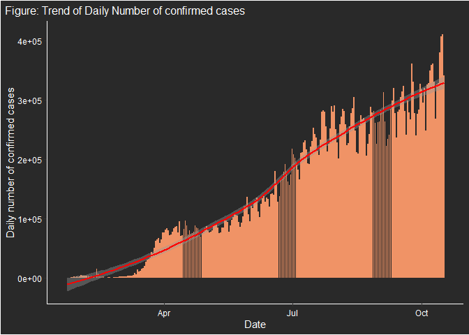
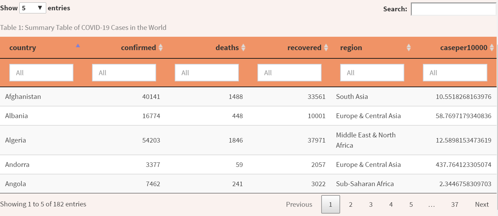

<!-- README.md is generated from README.Rmd. Please edit that file -->

# covid19shiny

<!-- badges: start -->

<!-- badges: end -->

The goal of covid19shiny is to provide users with a shinydashboard
created by using `shiny` and `shinydashboard` package, presenting the
state of COVID-19 in the world, which is enhanced with user
interactions. There are also some functions inside the package. The
shiny application could be launched by using `launch_app()` function
inside the package. This shinydashboard would allow users to gain
insights of COVID-19 state in the world.

List of data inside the package:  
\- **covid19wrangled** is the wrangled version of the data taken from
`download_merged_data` from
[tidycovid19](https://github.com/joachim-gassen/tidycovid19) package  
\- **covid19total** presents the summary of COVID-19 cases per country,
showing total confirmed cases, total deaths and total recovered cases of
a country alongside with other information  
\- **worldshp** is a world shape file needed to create a map

List of functions inside the package:  
\- **launch\_app** would launch the shiny application showing the state
of COVID-19 in the world  
\- **selectInput01** would produce the selectInput from `shiny`
according to the inputs provided  
\- **dailyplot** would create a line graph showing either the daily
confirmed cases, daily death, or daily recovered according to the inputs
specified. The input `variable_name` would change the y-axis of the line
graph to represent the variable  
\- **covidtable** would produce a table by using the `DT` package, which
is based on the specified dataset

More information on the package can be found on the [pkgdown
website](...).

## Installation

You can install the development version of `covid19shiny` package with:

``` r
# install.packages("devtools")
devtools::install_github("etc5523-2020/r-package-assessment-helenevangelinaa")
```

## Launching the app

This is a basic example on how to launch the shiny dashboard:

``` r
library(covid19shiny)
launch_app()
```

## Usage

The functions inside the package were made to simplify the R codes to
create the shiny application, as well as to make it easier for users to
produce the plot and table desired.

Here is an example of how to use the package to generate the dataset:

``` r
kable(covid19total)
```

``` r
head(covid19total, 10) %>%
  kable()
```

<table>

<thead>

<tr>

<th style="text-align:left;">

country

</th>

<th style="text-align:right;">

confirmed

</th>

<th style="text-align:right;">

deaths

</th>

<th style="text-align:right;">

recovered

</th>

<th style="text-align:left;">

region

</th>

<th style="text-align:right;">

population

</th>

<th style="text-align:right;">

latitude

</th>

<th style="text-align:right;">

longitude

</th>

<th style="text-align:right;">

caseper10000

</th>

</tr>

</thead>

<tbody>

<tr>

<td style="text-align:left;">

Afghanistan

</td>

<td style="text-align:right;">

40141

</td>

<td style="text-align:right;">

1488

</td>

<td style="text-align:right;">

33561

</td>

<td style="text-align:left;">

South Asia

</td>

<td style="text-align:right;">

38041754

</td>

<td style="text-align:right;">

33.93911

</td>

<td style="text-align:right;">

67.709953

</td>

<td style="text-align:right;">

10.551827

</td>

</tr>

<tr>

<td style="text-align:left;">

Angola

</td>

<td style="text-align:right;">

7462

</td>

<td style="text-align:right;">

241

</td>

<td style="text-align:right;">

3022

</td>

<td style="text-align:left;">

Sub-Saharan Africa

</td>

<td style="text-align:right;">

31825295

</td>

<td style="text-align:right;">

\-11.20269

</td>

<td style="text-align:right;">

17.873887

</td>

<td style="text-align:right;">

2.344676

</td>

</tr>

<tr>

<td style="text-align:left;">

Albania

</td>

<td style="text-align:right;">

16774

</td>

<td style="text-align:right;">

448

</td>

<td style="text-align:right;">

10001

</td>

<td style="text-align:left;">

Europe & Central Asia

</td>

<td style="text-align:right;">

2854191

</td>

<td style="text-align:right;">

41.15333

</td>

<td style="text-align:right;">

20.168331

</td>

<td style="text-align:right;">

58.769718

</td>

</tr>

<tr>

<td style="text-align:left;">

Andorra

</td>

<td style="text-align:right;">

3377

</td>

<td style="text-align:right;">

59

</td>

<td style="text-align:right;">

2057

</td>

<td style="text-align:left;">

Europe & Central Asia

</td>

<td style="text-align:right;">

77142

</td>

<td style="text-align:right;">

42.54624

</td>

<td style="text-align:right;">

1.601554

</td>

<td style="text-align:right;">

437.764123

</td>

</tr>

<tr>

<td style="text-align:left;">

United Arab Emirates

</td>

<td style="text-align:right;">

114387

</td>

<td style="text-align:right;">

459

</td>

<td style="text-align:right;">

106354

</td>

<td style="text-align:left;">

Middle East & North Africa

</td>

<td style="text-align:right;">

9770529

</td>

<td style="text-align:right;">

23.42408

</td>

<td style="text-align:right;">

53.847818

</td>

<td style="text-align:right;">

117.073497

</td>

</tr>

<tr>

<td style="text-align:left;">

Argentina

</td>

<td style="text-align:right;">

979119

</td>

<td style="text-align:right;">

26107

</td>

<td style="text-align:right;">

791174

</td>

<td style="text-align:left;">

Latin America & Caribbean

</td>

<td style="text-align:right;">

44938712

</td>

<td style="text-align:right;">

\-38.41610

</td>

<td style="text-align:right;">

\-63.616672

</td>

<td style="text-align:right;">

217.878741

</td>

</tr>

<tr>

<td style="text-align:left;">

Armenia

</td>

<td style="text-align:right;">

63000

</td>

<td style="text-align:right;">

1067

</td>

<td style="text-align:right;">

47925

</td>

<td style="text-align:left;">

Europe & Central Asia

</td>

<td style="text-align:right;">

2957731

</td>

<td style="text-align:right;">

40.06910

</td>

<td style="text-align:right;">

45.038189

</td>

<td style="text-align:right;">

213.001115

</td>

</tr>

<tr>

<td style="text-align:left;">

Antigua & Barbuda

</td>

<td style="text-align:right;">

119

</td>

<td style="text-align:right;">

3

</td>

<td style="text-align:right;">

101

</td>

<td style="text-align:left;">

Latin America & Caribbean

</td>

<td style="text-align:right;">

97118

</td>

<td style="text-align:right;">

NA

</td>

<td style="text-align:right;">

NA

</td>

<td style="text-align:right;">

12.253135

</td>

</tr>

<tr>

<td style="text-align:left;">

Australia

</td>

<td style="text-align:right;">

27390

</td>

<td style="text-align:right;">

904

</td>

<td style="text-align:right;">

25098

</td>

<td style="text-align:left;">

East Asia & Pacific

</td>

<td style="text-align:right;">

25364307

</td>

<td style="text-align:right;">

\-25.27440

</td>

<td style="text-align:right;">

133.775136

</td>

<td style="text-align:right;">

10.798639

</td>

</tr>

<tr>

<td style="text-align:left;">

Austria

</td>

<td style="text-align:right;">

63134

</td>

<td style="text-align:right;">

889

</td>

<td style="text-align:right;">

48771

</td>

<td style="text-align:left;">

Europe & Central Asia

</td>

<td style="text-align:right;">

8877067

</td>

<td style="text-align:right;">

47.51623

</td>

<td style="text-align:right;">

14.550072

</td>

<td style="text-align:right;">

71.120337

</td>

</tr>

</tbody>

</table>

The `selectInput01` function is a function created for the `selectInput`
shiny to simplify the code inside the app.R. In order to create a
selectInput, user has to specify the **id** and **choices** wanted to be
put into the selectInput. Here is an example:

``` r
selectInput01("country", covid19total$country)
```

This would create a selectInput of the countries listed in the
`covid19total` dataset so that users can choose their desired country to
be displayed on the following figures.

The second function, `dailyplot`, will produce a line graph based on the
inputs provided. The following code will produce a line graph of the
daily confirmed cases of the selected country from the selectInput. The
default is **All** which shows the total daily confirmed cases
worldwide.

``` r
dailyplot(input$country, "confirmed cases", "daily_confirmed")
```

Here is a sample line graph shown in the shiny app which is generated by
using `dailyplot` function (this function cannot be produced outside the
shinyapp as it is based on the input from selectInput
(i.e. input$country)):

``` r
dailyall <- covid19wrangled %>%
    group_by(date) %>%
    summarise(totalconfirmed = sum(confirmed),
              totaldeaths = sum(deaths),
              totalrecovered = sum(recovered)) %>%
    mutate(confirmed_lag = lag(totalconfirmed),
           daily_confirmed = totalconfirmed - confirmed_lag,
           death_lag = lag(totaldeaths),
           daily_death = totaldeaths - death_lag,
           recovered_lag = lag(totalrecovered),
           daily_recovered = totalrecovered - recovered_lag)
  
  plot_all <- dailyall %>%
    ggplot(aes_string(x = "date",
               y= "daily_confirmed")) +
    geom_col(fill = "#F09366") +
    geom_line(size = 0, alpha = 0) +
    geom_smooth(color = "red", size = 1) +
    labs(x = "Date",
         y = "Daily number of confirmed cases",
         title = "Figure: Trend of Daily Number of confirmed cases") +
    theme(panel.background = element_rect(fill = "grey16"),
          plot.background = element_rect(fill = "grey16"),
          panel.grid.major = element_blank(),
          panel.grid.minor = element_blank(),
          plot.title = element_text(size = 12), 
          plot.title.position = "plot",
          text = element_text(color = "white"),
          axis.text = element_text(color = "white"),
          axis.line.x = element_line(color = "white",
                                     size = 0.6),
          axis.line.y = element_line(color = "white",
                                     size = 0.6))
  
plot_all
```



The third function is the `covidtable` which creates a table by using
the `DT` package of the specified dataset. Here is an example of how to
use the `covidtable` function, which would result to a table shown
below:

``` r
covidtable(covid19total)
```


